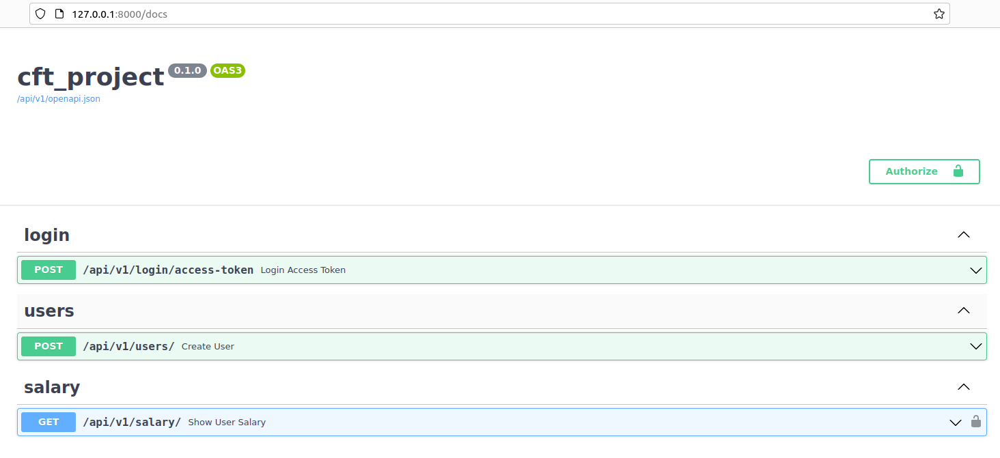

**Project requirements**:

* [Docker](https://www.docker.com/).
* [Docker Compose](https://docs.docker.com/compose/install/).
* [Poetry](https://python-poetry.org/) for Python package and environment management.

### 1. Запуск с помощью docker compose.

Для запуска всех частей проекта неоходимо выполнить:

1. Для сборки образов:
```shell
docker compose build
```

2. Для запуска всех сервисов:
```shell
docker compose up -d
```

После запуска всех сервисов для демонстрации работы и взаимодействию с API-сервиса можно открыть в окне браузера следующий адрес:


[127.0.0.1:8000/docs](127.0.0.1:8000/docs)




По умолчанию, в базе данных во время запуска инициализируются тестовые данные двух пользователей:
(в файле .env задаётся следующая переменная окружения: INITIAL_TEST_DATA=True)

1. test_one@example.com, user_one, pass_one
2. test_two@example.com, user_two, pass_two

Используя предоставленные тестовые пользовательские данные можно протестировать работу следующих конечных точек приложения:

1. **login** - позволяет авторизироваться в системе и получить JWT-токен.
2. **salary** - используя полученный jwt-токен запросить конфиденциальные данные зарплаты конкретного пользователя(зарпалата, дата повышения).
3. **users** - создать нового пользователя(по необходимости).

### 2. Запуск тестов.

[Для запуска тестов см.](./app/README.md)
